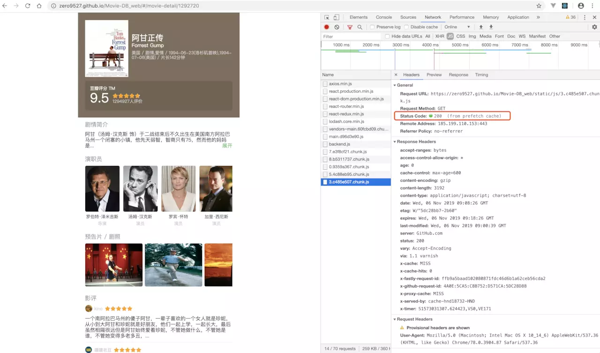
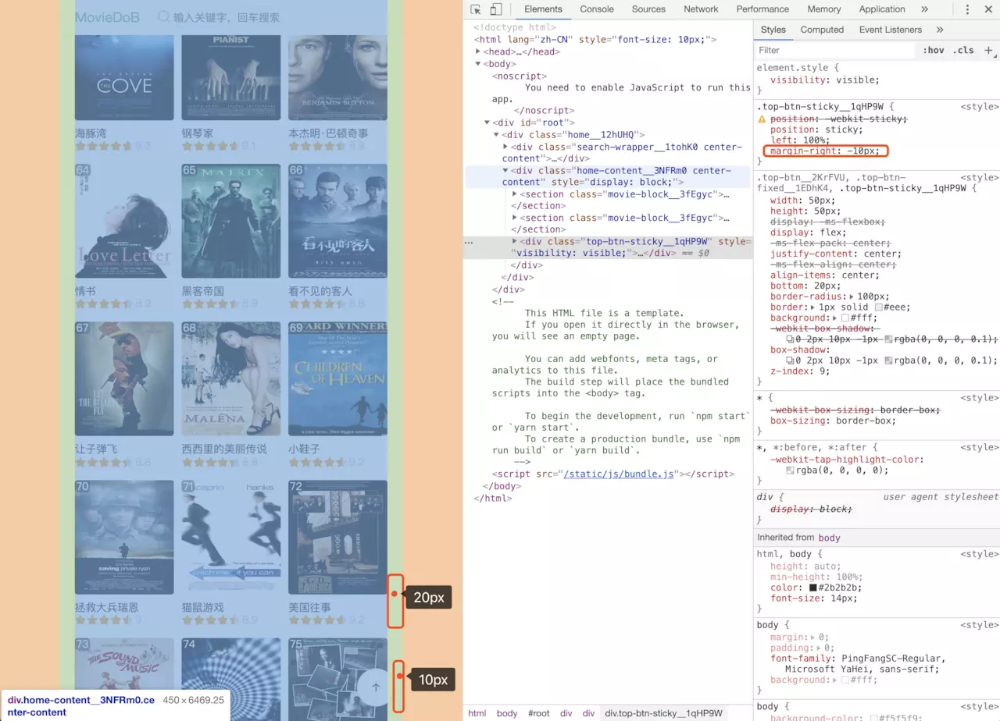

# 一个豆瓣电影 MovieDob 网页版

## 前言
前面已经写了一个 [一个豆瓣电影小程序](https://juejin.im/post/5dafcf736fb9a04e2f71dc91) 的微信小程序；现在这个是 React+Typescript 的网页版，基于 [这里](https://juejin.im/post/5d3faa3a5188255d2e32c6e3) 的修改版，antd 换为 antd-mobile

[源码](https://github.com/zero9527/Movie-DB_web)，[在线预览](https://zero9527.github.io/Movie-DB_web/)

## 1、关于 Class 组件、函数组件+Hooks
### 1.1 什么时候用 函数组件+Hooks ?
小功能组件，比如倒计时、数量加减框、评分、搜索框等等 **不涉及** 异步请求、各种监听（scroll等）的组件

* React Hooks 的使用还是愉快的，简单功能的开发很省代码；
* `useMemo` 可以当作 `computed` 使用，`useEffect` 可以实现 `watch` 的效果，也可以有 `mount/unmount` 的效果，还有其他方便的东西
* 基本上可以视为 Class 组件的 `render` 部分;


### 1.2 继续用 Class 组件 
#### 组件销毁前，请求还在继续～
  * 要么 **撤销请求（axios CancelToken）**<br />
    这个比较麻烦，要对每个请求做处理。。。
  * 要么 在组件 unmount 前 **重写 this.setState 方法**
  ```js
  public componentWillUnmount() {
    // 组件销毁后，不操作数据
    this.setState = () => {};
  }
  ```

#### 监听滚动
* 函数+Hooks 写法：
  * **useEffect 第二个参数为传空数组[]*：* 在 `_onScroll` 内 `useState` 只会起作用一次！！！很诡异（Capture Value ?）。。。
  一开始我是这么写的，
  * **useEffect 第二个参数不传：** 这样就可以，但是这样又会导致 **每次 state 变化** 执行一次，官方的 Demo 写法好像就是这样的。。。不知道这是不是正确的姿势！？！

  可以在 [这里](https://codesandbox.io/s/react-function-component-hooks-scroll-hlxjm) 看看

* Class 组件写法：
```js
// src/views/home/index.tsx
  constructor(props: IProps) {
    super(props);
    this._onScroll = this._onScroll.bind(this);
  }
  
  public componentDidMount() {
    window.addEventListener('scroll', this._onScroll);
  }

  public componentWillUnmount() {
    window.removeEventListener('scroll', this._onScroll);
  }
```

## 2、列表 keep-alive
由于 React 没有像 Vue 提供的 `<keep-alive></keep-alive>` 组件，要实现这个就自己动手来，这个在 [这里](https://juejin.im/post/5d512fa1e51d4561d41d2dbe) 已经大概说了一下

### 2.1 路由的写法
这里的 `AuthRoute` 是基于官方 Route 的封装；主要就是使用 Route 的 `render` 方法 渲染列表页，然后详情页是作为 `children` 挂在列表页下面的

```js
// src/routes/home.tsx
import AuthRoute from '@/routes/auth-route';
import * as React from 'react';
import Loadable from '@loadable/component';

const Home = Loadable(() => import('@/views/home'));
const SearchList = Loadable(() => import('@/views/search-list'));

// home
export default [
  <AuthRoute 
    key="search"
    path="/search"
    render={() => (
      <SearchList>
        <AuthRoute 
          exact={true} 
          path="/search/movie-detail/:id" 
          component={Loadable(() => import('@/views/movie-detail'))} 
        />
      </SearchList>
    )}
  />,
  <AuthRoute 
    key="home" 
    path="/" 
    render={() => (
      <Home>
        <AuthRoute 
          exact={true} 
          path="/movie-detail/:id" 
          component={Loadable(() => import('@/views/movie-detail'))} 
        />
      </Home>
    )}
  />
]
```

### 2.2 列表组件的处理
#### 2.2.1 详情页组件
* 在详情页路由时，隐藏列表页的内容
* `this.props.children` 就是上面 `<Home>` 里面的东西

```js
// src/views/home/index.tsx

  public isDetailPage() {
    return this.props.location.pathname.includes("/movie-detail/");
  }

  public render() {
    const { 
      movieLineStatus, 
      isLoading, 
      movieLine, 
      movieComing, 
      movieTop250, 
      isTop250FullLoaded
    } = this.state;

    return (
      <div className={`${styles.home}`}>
        {!this.isDetailPage() &&
          <HeaderSearch onConfirm={(val) => this.onConfirm(val)} />
        }
        <div 
          className={`${styles['home-content']} center-content`}
          style={{ 
            display: this.isDetailPage() 
            ? 'none' 
            : 'block' 
          }}>
          <section className={styles['movie-block']}>
            <div className={styles['block-title']}>
              <span className={`${styles['title-item']} ${movieLineStatus === 0 && styles['title-active']}`}
                onClick={() => this.movieStatusChange(0)}
              >院线热映</span>
              <span className={`${styles['title-item']} ${movieLineStatus === 1 && styles['title-active']}`}
                onClick={() => this.movieStatusChange(1)}
              >即将上映</span>
            </div>
    
            {movieLineStatus === 0 ? (
              <MovieItem movieList={movieLine} toDetail={(id: string) => this.toDetail(id)} />
            ) : (
              <MovieItem movieList={movieComing} toDetail={(id: string) => this.toDetail(id)} />
            )}
          </section>
    
          <MovieTop250 isLoading={isLoading} movieTop250={movieTop250} toDetail={(id: string) => this.toDetail(id)} />
    
          {isLoading && <Loading />}

          <TopBtn />

          {isTop250FullLoaded && <div className={styles.nomore}>没有更多数据了~</div>}
        </div>
        
        {/* detial */}
        { this.props.children }
      </div>
    )
  }
```

#### 2.2.2 滚动位置恢复

* 在列表页路由下，监听滚动事件，保存滚动条位置 `scrollTop`；
* 进入详情页路由时，移除滚动事件监听
* 回到列表页面时，恢复滚动条位置

```js
// src/views/home/index.tsx
  constructor(props: IProps) {
    super(props);
    this._onScroll = this._onScroll.bind(this);
  }

  public componentDidMount() {
    this._getMovieLine();
    this._getMovieTop250();
    getMovieTop250All();

    this.props.history.listen(route => {
      this.onRouteChange(route);
    })

    window.addEventListener('scroll', this._onScroll);
  }

  public componentWillUnmount() {
    // 组件销毁后，不操作数据
    this.setState = () => {};
    window.removeEventListener('scroll', this._onScroll);
  }

  // 监听路由变化
  public onRouteChange(route: any) {
    // 首页
    if (route.pathname === '/') {
      const { scrTop } = this.state;
      window.addEventListener('scroll', this._onScroll);
      // 恢复滚动条位置
      this.setScrollTop(scrTop);
    }
    // 详情页
    if (route.pathname.includes("/movie-detail/")) {
      // 重置滚动条位置
      this.setScrollTop(0);
      window.removeEventListener('scroll', this._onScroll);
    }
  }

  // 设置滚动条位置
  public setScrollTop(top: number) {
    document.body.scrollTop = top;
    document.documentElement.scrollTop = top;
  }

  public _onScroll() {
    const winHeight = window.innerHeight;
    const srcollHeight = document.documentElement.scrollHeight;
    const scrollTop = document.body.scrollTop || document.documentElement.scrollTop;
    const toBottom = srcollHeight - winHeight - scrollTop;

    if (toBottom <= 200) {
      this._getMovieTop250({ start: this.state.currentPage*10 });
    }
    if (this.props.location.pathname === '/') {
      this.setState({ scrTop: scrollTop });
    } else {
      window.removeEventListener('scroll', this._onScroll);
    }
  }
```


## 3、代码预加载 prefetch
webpack v4.6.0+ 的功能，[文档](https://webpack.docschina.org/guides/code-splitting/#%E9%A2%84%E5%8F%96-%E9%A2%84%E5%8A%A0%E8%BD%BD%E6%A8%A1%E5%9D%97-prefetch-preload-module-)

在首页路由，浏览器空闲时下载代码，从首页进入详情页时直接从缓存中读取，没有白屏



使用如：
```js
const Detail = Loadable(() => import(/* webpackPrefetch: true */ '@/views/movie-detail'));
```

路由：
```js
// src/routes/home.tsx
import AuthRoute from '@/routes/auth-route';
import * as React from 'react';
import Loadable from '@loadable/component';

const Home = Loadable(() => import('@/views/home'));
const SearchList = Loadable(() => import('@/views/search-list'));
const Detail = Loadable(() => import(/* webpackPrefetch: true */ '@/views/movie-detail'));

// home
export default [
  <AuthRoute 
    key="search"
    path="/search"
    render={() => (
      <SearchList>
        <AuthRoute 
          exact={true} 
          path="/search/movie-detail/:id" 
          component={Detail} 
        />
      </SearchList>
    )}
  />,
  <AuthRoute 
    key="home" 
    path="/" 
    render={() => (
      <Home>
        <AuthRoute 
          exact={true} 
          path="/movie-detail/:id" 
          component={Detail} 
        />
      </Home>
    )}
  />
]
```


## 4、定位 position: sticky;

根据父元素的内容位置定位，会被限制在 `padding` 内，可以用 `margin` 负边距或者 `transform` 等改变位置；

### 4.1 回到顶部按钮

父元素有 `padding: 10px 20px;`，子元素设置  `position: sticky; bottom: 0; left: 100%;` ，但是会被限制在 `padding` 的范围内，原来是使用 `bottom: 0; rihgt: 0;` 的，但是 `right: 0;` 不起作用。。。所以用 `margin-right: -10px` 修改一下位置

> `CSS.supports('position', 'sticky')` 可以判断浏览器是否支持 `position: sticky;`




`<TopBtn />` 样式:
```scss
// src/components/scrollToTop/scrollToTop.scss
.top-btn {
  width: 50px;
  height: 50px;
  display: flex;
  justify-content: center;
  align-items: center;
  bottom: 20px;
  border-radius: 100px;
  border: 1px solid #eee;
  background: #fff;
  box-shadow: 0 2px 10px -1px rgba(0, 0, 0, 0.1);
  z-index: 9;
  &:active {
    background: #eee;
  }
}
.top-btn-fixed {
  position: fixed;
  right: 20px;
  @extend .top-btn;
}

.top-btn-sticky {
  position: sticky;
  left: 100%;
  margin-right: -10px;
  @extend .top-btn;
}
```

`<TopBtn />` 组件: 
```js
// src/components/scrollToTop/index.tsx
import * as React from 'react';
import styles from './scrollToTop.scss';

const { useState, useEffect } = React;

/**
 * scrollToTop
 */
function scrollToTop() {
  const [showBtn, setShowBtn] = useState(false);

  useEffect(() => {
    const height = window.innerHeight;

    // 滚动距离大于一屏高度则显示，否则隐藏
    setShowBtn(() => (
      document.body.scrollTop >= height
      || document.documentElement.scrollTop >= height
    ));
  }, [document.body.scrollTop, document.documentElement.scrollTop]);

  function toTop() {
    if (window.scroll) {
      window.scroll({ top: 0, left: 0, behavior: 'smooth' });
      
    } else {
      document.body.scrollTop = 0;
      document.documentElement.scrollTop = 0;
    }
  }

  return (
    <div 
      className={
        CSS.supports('position', 'sticky') 
          ? styles['top-btn-sticky'] 
          : styles['top-btn-fixed']
      } 
      style={{visibility: showBtn ? 'visible' : 'hidden'}}
      onClick={toTop}
    >
      <i className="iconfont icon-arrow-upward-outline" />
    </div>
  );
}

export default scrollToTop;
```


## 最后
其他的没什么，项目本身也不复杂；框架用的是之前搭的 React+Typescript+antd-mobile，axios/css-modules/sass 等等这些都是标配啦；东西不多，原来的是 antd 这个是移动端所以换成 antd-mobile
