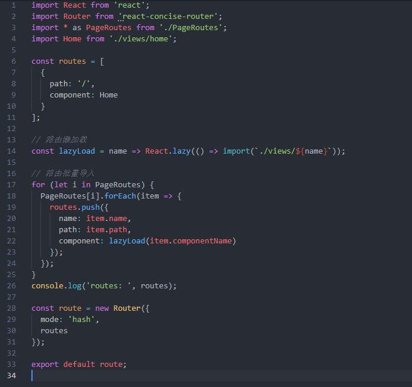
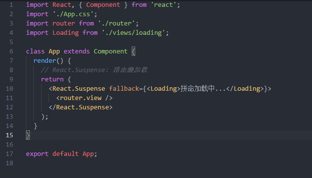

# react学习笔记一：路由及懒加载

## src/router.js:
这里用到了这个库`react-concise-router`，这个版本不支持路由嵌套，实际上React-Router v4开始也是不支持直接嵌套的；
<!--使用React Router原生用法和更多的细节放在了[另一篇]()-->
```
React.lazy(() => import(component))
```




## src/App.js: 
```
<React.Suspense fallback={<Loading>拼命加载中...</Loading>}>
    <router.view />
</React.Suspense>
```
> 注：fallback是路由跳转的回调，可以放loading组件

